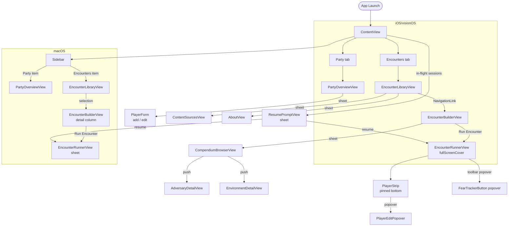

# Encounter — UI Vocabulary

Reference for consistent language when filing issues, writing feedback, or describing
UI behavior. Covers screen names, navigation paths, component names, and accessibility
identifiers.

---

## Design Language

Canonical icon and color choices for core Daggerheart mechanics. Decided in [ADR-0039](decisions/0039-icon-color-design-language.md). All symbol names verified in SF Symbols 7 (9,184 symbols).

### Icons

| Concept | Symbol | Rendering | Tint |
|---|---|---|---|
| Hit Points | `heart.fill` | Monochrome | Crimson `#C0392B` |
| Armor | `shield.fill` | Monochrome | Steel gray (system secondary label) |
| Stress | `bolt.fill` | Monochrome | Amber `#E67E22` |
| Fear (GM resource) | `flame.fill` | Monochrome | System orange |
| Hope (player resource) | `bolt.heart.fill` | Monochrome | Warm gold `#F0C040` |

### Condition icons

| Condition | Symbol |
|---|---|
| Hidden | `eye.slash.fill` |
| Restrained | `tag.fill` |
| Vulnerable | `shield.slash.fill` |

### Color palette

| Role | Color | Notes |
|---|---|---|
| HP | Crimson `#C0392B` | Universal health signal |
| Armor | System secondary label | Neutral protection |
| Stress | Amber `#E67E22` | Escalates toward orange/red at high values |
| Fear | System orange | Already established in app |
| Hope | Warm gold `#F0C040` | Warmth, agency, player-owned |
| Active condition | System orange | Matches fear register — conditions are threats |
| Inactive / depleted | System secondary | Quiet — empty states recede |

### Reserved symbols (future features)

| Symbol | Reserved for |
|---|---|
| `dice.fill` / `die.face.N.fill` | Dice-roll feature |
| `wand.and.sparkles` | LLM encounter-generation |

### Design rationale

Hope and Fear are not moral opposites in Daggerheart — they are complementary momentum resources. The icon pair `bolt.heart.fill` (Hope) and `flame.fill` (Fear) contrasts through **shape**, not just color, so the duality reads even in monochrome. Both carry an "energy" quality that reflects the game's dual-dice mechanic.

Stress shares the energy register with Hope (`bolt.fill` vs `bolt.heart.fill`) but belongs to the threat/pressure color column. This mirrors the mechanical relationship: spending Hope often causes Stress.

See ADR-0039 for three alternative proposals (Blade & Spirit, Beacon & Storm, Signal Board) that were considered and may be revisited.

---

## Navigation Map



---

## Screen Reference

### ContentView

Root container. On **iOS/visionOS** it is a `TabView` with two tabs. On **macOS** it is
a three-column `NavigationSplitView` (sidebar → content → detail).

| Platform | Navigation model |
|---|---|
| iOS / visionOS | TabView — Party tab, Encounters tab |
| macOS | NavigationSplitView — sidebar, content pane, detail pane |

**Accessibility identifiers**

| Element | Identifier |
|---|---|
| Party tab (iOS) | `tab.party` |
| Encounters tab (iOS) | `tab.encounters` |
| Sidebar "Party" item (macOS) | `sidebar.party` |
| Sidebar "Encounters" item (macOS) | `sidebar.encounters` |

---

### Party Tab — PartyOverviewView

Main roster management screen. Reachable via the **Party tab** (iOS) or **Party** sidebar
item (macOS).

**Layout**

```
┌─────────────────────────────────┐
│  Navigation bar: "Party"        │
│  [Toolbar: Add Player] [Reset]  │
├─────────────────────────────────┤
│  Section: Active Party          │
│  ┌───────────────────────────┐  │
│  │ PlayerPartyRow            │  │
│  │ PlayerPartyRow            │  │
│  └───────────────────────────┘  │
│  Section: Roster                │
│  ┌───────────────────────────┐  │
│  │ PlayerPartyRow            │  │
│  └───────────────────────────┘  │
└─────────────────────────────────┘
```

**Regions**

| Region | Description |
|---|---|
| Active Party section | Players currently in the encounter party |
| Roster section | All other saved players |
| Empty overlay | `ContentUnavailableView` shown when no players exist |

**Toolbar actions**

| Button | Action |
|---|---|
| Add Player | Opens PlayerForm in add mode |
| Reset All | Destructive action: resets all player stats |

**Swipe actions (iOS)**

| Section | Leading | Trailing |
|---|---|---|
| Active Party | — | Edit, Remove from party |
| Roster | Add to party | Delete |

**Accessibility identifiers**

| Element | Identifier |
|---|---|
| Player list | `party.list` |
| Active party row | `party.active-row` |
| Roster row | `party.roster-row` |
| Add Player button | `party.add-player-button` |
| Reset All button | `party.reset-all-button` |
| Empty state label | `party.empty-party-label` |
| Empty state add button | `party.empty-add-button` |

---

### PlayerForm

Modal sheet for adding or editing a player. Two modes: **add** (title "Add Player") and
**edit** (title "Edit Player").

**Layout**

```
┌─────────────────────────────────┐
│  [Cancel]  Add Player  [Add]    │
├─────────────────────────────────┤
│  Section: Character             │
│    Name field                   │
│    Level stepper                │
│  Section: Stats                 │
│    Max HP · Max Stress · Evasion│
│  Section: Damage Thresholds     │
│    Major · Severe               │
│  Section: Armor                 │
│    Armor Slots                  │
├─────────────────────────────────┤
│  [Add Another Player] (iOS)     │
└─────────────────────────────────┘
```

**Accessibility identifiers**

| Element | Identifier |
|---|---|
| Name field | `party.form.name-field` |
| Level stepper | `party.form.level-stepper` |
| Cancel button | `party.form.cancel-button` |
| Add / Save button | `party.form.commit-button` |
| Add Another button (iOS) | `party.form.add-another-button` |
| Form scroll area | `party.form.scroll` |

---

### Encounters Tab — EncounterLibraryView

Encounter library browser. Reachable via the **Encounters tab** (iOS) or **Encounters**
sidebar item (macOS).

**States**

| State | Display |
|---|---|
| Loading | Centered `ProgressView` |
| Empty | `EncounterLibraryEmptyState` with Create button |
| Populated | `EncounterLibraryList` |

**Toolbar actions**

| Button | Action |
|---|---|
| New Encounter (+) | Alert prompting for name, then creates encounter |
| Content Sources (archive box) | Opens ContentSourcesView sheet |
| About (ℹ) | Opens AboutView sheet (iOS/visionOS only) |

**Alerts / Dialogs**

| Dialog | Purpose |
|---|---|
| New Encounter alert | Text field for encounter name |
| Rename Encounter alert | Text field pre-filled with current name |
| Delete Encounter? | Confirmation before permanent delete |

**Accessibility identifiers**

| Element | Identifier |
|---|---|
| Encounter list | `library.list` |
| Encounter row | `library.row` |
| New Encounter button | `library.create-button` |
| Content Sources button | `library.sources-button` |
| About button | `library.about-button` |
| New name field (alert) | `library.new-name-field` |
| Rename field (alert) | `library.rename-field` |

---

### EncounterBuilderView

Encounter preparation screen. Reachable by tapping an encounter in the library.

**Layout**

```
┌─────────────────────────────────┐
│  [< Back] Encounter Name [Run]  │
│  [Browse Compendium]            │
├─────────────────────────────────┤
│  Form:                          │
│  ┌─ Section: Adversaries ─[+]─┐ │
│  │ AdversaryRosterRow          │ │
│  │ AdversaryRosterRow          │ │
│  └────────────────────────────┘ │
│  ┌─ Section: Environment ─────┐ │
│  │ EnvironmentRow / empty     │ │
│  └────────────────────────────┘ │
│  ┌─ Section: Players ─────────┐ │
│  │ PlayerPartyRow (read-only) │ │
│  └────────────────────────────┘ │
│  ┌─ Section: Notes ───────────┐ │
│  │ DisclosureGroup > TextEditor│ │
│  └────────────────────────────┘ │
├─────────────────────────────────┤
│  DifficultyAssessorView        │
└─────────────────────────────────┘
```

**Toolbar actions**

| Button | Action |
|---|---|
| Run Encounter | Starts session; navigates to EncounterRunnerView |
| Browse Compendium (books) | Opens CompendiumBrowserView sheet |
| Reset Session | Clears in-progress session (shown only when session exists) |

**Sections**

| Section | Component | Notes |
|---|---|---|
| Adversaries | `AdversaryRosterSection` | Swipe-to-delete; Add button in header |
| Environment | `EnvironmentSection` | 0 or 1 environments; Add / Replace buttons |
| Players | `PlayerRosterSection` | Read-only mirror of Active Party |
| Notes | `BuilderNotesSection` | Collapsible `DisclosureGroup` with `TextEditor` |
| Difficulty | `DifficultyAssessorView` | Fixed to bottom; not part of scroll |

**Accessibility identifiers**

| Element | Identifier |
|---|---|
| Run Encounter button | `builder.run-button` |
| Browse Compendium button | `builder.browse-compendium-button` |
| Reset Session button | `builder.reset-button` |
| Reset confirm button | `builder.reset-confirm-button` |
| Add Adversary button | `builder.add-adversary-button` |
| Add Environment button | `builder.add-environment-button` |
| Replace Environment button | `builder.replace-environment-button` |
| Player row (read-only) | `builder.player-row` |
| Notes text editor | `builder.notes-field` |
| Difficulty toggle (each) | `builder.difficulty.toggle.<name>` |

---

### DifficultyAssessorView

Non-scrolling panel pinned to the bottom of EncounterBuilderView. Displays the
encounter's difficulty budget and allows the GM to apply manual adjustments.

**Layout**

```
┌─────────────────────────────────┐
│ ──────────────────────────────  │
│ Well Matched          12 / 12 BP│
│ ✓ Multiple Solos  (auto-detect) │
│ □ Easier Fight    (GM toggle)   │
│ □ Harder Fight    (GM toggle)   │
│ □ Boosted Damage  (GM toggle)   │
│ □ Lower Tier      (GM toggle)   │
└─────────────────────────────────┘
```

**Budget color coding**

| Label | Color | Budget remaining |
|---|---|---|
| Too Easy | Teal | ≥ +4 |
| Well Matched | Green | +1 to +3 |
| On Budget | Green | 0 |
| Challenging | Orange | −1 to −3 |
| Dangerous | Red | −4 to −6 |
| Likely TPK | Pulsing red | ≤ −7 |

---

### CompendiumBrowserView

Modal sheet for browsing and adding adversaries and environments to an encounter.
Contains a segmented tab picker at the top.

**Tabs**

| Tab | Content |
|---|---|
| Adversaries | `AdversaryListView` with search + type filter |
| Environments | `EnvironmentListView` with search |

**Toolbar actions**

| Button | Action |
|---|---|
| Done | Dismisses sheet |
| Filter (adversaries tab) | Menu of adversary types to narrow list |

**Navigation destinations (push)**

| Destination | Trigger |
|---|---|
| `AdversaryDetailView` | Tap an adversary row |
| `EnvironmentDetailView` | Tap an environment row |

**Accessibility identifiers**

| Element | Identifier |
|---|---|
| Tab picker | `compendium.tab-picker` |
| Done button | `compendium.done-button` |
| Adversary list | `compendium.adversary-list` |
| Adversary row | `compendium.adversary-row` |
| Environment list | `compendium.environment-list` |
| Environment row | `compendium.environment-row` |
| Add to Encounter button | `compendium.add-to-encounter-button` |

---

### AdversaryDetailView

Full stat card for a single adversary. Pushed from `AdversaryListView`.

**Sections**

| Section | Contents |
|---|---|
| Identity | Role badge, tier, source badge (homebrew), description |
| Combat Stats | Difficulty, HP, Stress, Major/Severe thresholds |
| Standard Attack | Attack name/modifier, range, damage |
| Experience | Flavor text (if present) |
| Features | Passives, Actions, Reactions via `FeatureSectionsView` |
| Motives & Tactics | Text block (if present) |

**Toolbar (when opened from builder)**

| Button | Action |
|---|---|
| Add to Encounter | Selects this adversary and dismisses compendium |

---

### EnvironmentDetailView

Full detail card for a single environment. Pushed from `EnvironmentListView`.

**Sections**

| Section | Contents |
|---|---|
| Identity | Source badge (homebrew), description |
| Features | Passives, Actions, Reactions via `FeatureSectionsView` |

**Toolbar (when opened from builder)**

| Button | Action |
|---|---|
| Add to Encounter | Selects this environment and dismisses compendium |

---

### EncounterRunnerView

Live encounter tracking screen. Full-screen on iOS; sheet on macOS.

**Layout**

```
┌─────────────────────────────────┐
│  [< End] Encounter Name [🔥 3]  │
├─────────────────────────────────┤
│  AdversaryRunnerSection         │
│  ┌──────────────────────────┐   │
│  │ AdversaryRunnerRow       │   │ ← collapsed slot
│  │ AdversaryRunnerCard      │   │ ← expanded slot (one at a time)
│  │ AdversaryRunnerRow       │   │
│  └──────────────────────────┘   │
│  (defeated slots greyed, bottom)│
├─────────────────────────────────┤
│  PlayerStrip (pinned bottom)    │
│  ┌──────────────────────────┐   │
│  │ PlayerStripRow           │   │
│  │ PlayerStripRow           │   │
│  └──────────────────────────┘   │
└─────────────────────────────────┘
```

**Regions**

| Region | Component | Description |
|---|---|---|
| Adversary section | `AdversaryRunnerSection` | `ForEach` over sorted slots; drives the accordion via a single `expandedSlotID` binding |
| Player panel | `PlayerStrip` | Pinned to bottom via `safeAreaInset`; always visible |

**Key behaviors**

- Only one adversary slot is expanded at a time (accordion).
- Defeated slots are dimmed and non-interactive; sorted to the bottom.
- PlayerStrip is always visible; tapping a row opens PlayerEditPopover.

**Toolbar actions**

| Button | Action |
|---|---|
| Fear Tracker (🔥 N) | Opens FearTrackerButton popover |
| End Encounter | Ends session and dismisses runner |
| Reset Session | Clears session state (confirmation required) |

**Accessibility identifiers**

| Element | Identifier |
|---|---|
| Adversary list | `runner.adversary-list` |
| Adversary row (collapsed) | `runner.adversary-row` |
| Fear Tracker button | `runner.fear-tracker-button` |
| End Encounter button | `runner.end-button` |
| Reset Session button | `runner.reset-button` |
| Reset confirm button | `runner.reset-confirm-button` |

---

### AdversaryRunnerCard (Expanded Slot)

Inline expanded view of one adversary slot. Shown when the slot is tapped in the runner.

**Layout**

```
┌──────────────────────────────────────┐
│ [Adversary Name]      [Collapse ▲]  │  ← header (tap name to rename)
│ HP  ○○○○○●●●●●  [−] 6/10 [+]       │  ← HP track
│ [Minor 8−] [Major 15−] [Severe 15+] │  ← threshold buttons
│ [+ 1 Stress (1/5)]                  │  ← stress button
│ Conditions:                          │
│ [Restrained] [Vulnerable] …         │  ← condition toggles (scrollable)
│ ─────────────────────────────────── │
│ Difficulty 14  Thresholds 8/15      │  ← stat reference block
│ Attack: Claws +5  Damage: 2d6+3     │
│ Features: …                         │
└──────────────────────────────────────┘
```

**Accessibility identifiers**

| Element | Identifier |
|---|---|
| Name button (tap to rename) | `runner.adversary-card.name` |
| Name text field (while editing) | `runner.adversary-card.name-field` |
| Rename Done button | `runner.adversary-card.rename-done-button` |
| Rename Cancel button | `runner.adversary-card.rename-cancel-button` |
| Rename error message | `runner.adversary-card.name-error` |
| Collapse button | `runner.adversary-card.collapse-button` |
| HP decrement | `runner.adversary-card.hp.decrement` |
| HP label | `runner.adversary-card.hp.label` |
| HP increment | `runner.adversary-card.hp.increment` |
| Stress button | `runner.adversary-card.stress-button` |
| Condition toggle (each) | `runner.adversary-card.condition.<name>` |
| Threshold: minor | `runner.threshold.minor` |
| Threshold: major | `runner.threshold.major` |
| Threshold: severe | `runner.threshold.severe` |

---

### PlayerStrip

Always-visible panel pinned to the bottom of EncounterRunnerView. Contains one
`PlayerStripRow` per player in the active party. Background: `.regularMaterial`.

---

### PlayerStripRow

Single player summary row inside PlayerStrip. Displays name, HP pip, Stress pip,
Armor count, and active conditions. Tap opens PlayerEditPopover.

**Accessibility identifiers**

| Element | Identifier |
|---|---|
| Player row button | `runner.player-row` |

---

### PlayerEditPopover

Popover that opens from a PlayerStripRow tap. Allows editing the player's current
HP, Stress, and Armor, and toggling conditions.

**Layout**

```
┌──────────────────────────┐
│  Player Name (headline)  │
│  HP    [−] 8 / 12 [+]   │
│  Stress [−] 2 / 6  [+]  │
│  Armor  [−] 1 / 3  [+]  │
│  ─────────────────────── │
│  Conditions:             │
│  [Restrained] [Dazed] …  │
└──────────────────────────┘
```

**Accessibility identifiers**

| Element | Identifier |
|---|---|
| HP decrement | `runner.player-edit.hp.decrement` |
| HP increment | `runner.player-edit.hp.increment` |
| Stress decrement | `runner.player-edit.stress.decrement` |
| Stress increment | `runner.player-edit.stress.increment` |
| Armor decrement | `runner.player-edit.armor.decrement` |
| Armor increment | `runner.player-edit.armor.increment` |
| Condition toggle (each) | `runner.player-edit.condition.<name>` |

---

### FearTrackerButton Popover

Popover opened from the Fear Tracker toolbar button in EncounterRunnerView.

**Layout**

```
┌──────────────────────────┐
│  Fear                    │
│        3                 │  ← current pool (large, orange)
│  [+1]  [−1]  [−2]  [−3] │
│  ──────────────────────  │
│  Set to… [____] [Set]   │
└──────────────────────────┘
```

**Accessibility identifiers**

| Element | Identifier |
|---|---|
| Increment (+1) | `runner.fear.increment` |
| Spend 1 (−1) | `runner.fear.spend-1` |
| Spend 2 (−2) | `runner.fear.spend-2` |
| Spend 3 (−3) | `runner.fear.spend-3` |
| Custom value field | `runner.fear.custom-field` |
| Set button | `runner.fear.custom-set` |

---

### ResumePromptView

Launch-time sheet shown when the app detects in-progress sessions.

**States**

| State | Layout |
|---|---|
| Single session | Centered card with shield icon, encounter name, adversary count, Resume button |
| Multiple sessions | Scrollable list of session buttons |

**Toolbar**

| Button | Action |
|---|---|
| Not Now | Dismisses sheet without resuming |

**Accessibility identifiers**

| Element | Identifier |
|---|---|
| Resume button (single) | `resume.resume-button` |
| Session button (multiple) | `resume.session-<UUID>` |
| Dismiss button | `resume.dismiss-button` |

---

### ContentSourcesView

Sheet for managing imported and remote content packs. Opened from the Content Sources
toolbar button in EncounterLibraryView.

**Sections**

| Section | Contents |
|---|---|
| Local Imports | `.dhpack` files imported from the file system |
| Remote Sources | URL-fetched content packs |

**Accessibility identifiers**

| Element | Identifier |
|---|---|
| Sources list | `sources.list` |
| Source row | `sources.row` |
| Remove button | `sources.row.remove-button` |
| Done button | `sources.done-button` |

---

### AboutView

App information and attribution sheet. Opened from the About toolbar button (iOS) or
the menu bar (macOS).

**Sections:** App Info, Attribution, Disclaimer.

---

## Component Glossary

Reusable components that appear across multiple screens.

| Component | Where used | Description |
|---|---|---|
| `PlayerPartyRow` | PartyOverviewView, PlayerRosterSection | Name + level/tier badge + stat caption row |
| `AdversaryRosterRow` | AdversaryRosterSection | Adversary name + role/tier badge in the builder |
| `AdversaryRunnerRow` | EncounterRunnerView (collapsed) | Collapsed slot: name, HP pip track, Stress pip track, conditions |
| `PipTrack` | AdversaryRunnerRow, AdversaryRunnerCard | HP/Stress visual tracker — pips (≤10) or "X/Y" text (>10) |
| `ThresholdButton` | AdversaryRunnerCard | Tap to apply Minor/Major/Severe damage marks |
| `AdversaryConditionsSection` | AdversaryRunnerCard | Scrollable row of toggleable condition buttons (adversary) |
| `PlayerConditionsSection` | PlayerEditPopover | Scrollable row of toggleable condition buttons (player) |
| `FeatureSectionsView` | AdversaryDetailView, EnvironmentDetailView | Feature list grouped by Passives / Actions / Reactions |
| `AdversaryFeatureRow` | FeatureSectionsView | Feature name + kind badge + description text |
| `DifficultyAssessorView` | EncounterBuilderView | Budget summary + auto-detected flags + GM toggles |
| `AdversaryStatReference` | AdversaryRunnerCard | Inline compact stat block (difficulty, thresholds, attack, features) |
| `TypeBadgeView` | AdversaryRow, AdversaryRunnerRow, AdversaryRunnerCard | Capsule badge for adversary role (e.g. "minion", "solo") |
| `LevelTierBadge` | PlayerPartyRow | "Lv 3 · T1" badge for player characters |
| `EncounterErrorBanner` | EncounterLibraryView, EncounterBuilderView | Non-blocking error strip pinned to top via safeAreaInset |
| `LastFetchedLabel` | ContentSourceRow | Caption: "Last updated X ago" or "Never updated" |
| `ContentSourceRow` | ContentSourcesView | Source name + origin URL/label + fetch status |
| `EncounterLibraryRow` | EncounterLibraryList | Encounter name + relative modified date (e.g. "2 hours ago") |

---

## Platform Layout Differences

| Feature | iOS / visionOS | macOS |
|---|---|---|
| Root navigation | TabView (Party, Encounters) | NavigationSplitView (sidebar + content + detail) |
| Encounter runner presentation | `fullScreenCover` | Sheet |
| List actions | Swipe actions (trailing) | Context menus |
| Navigation bar style | `.large` on main screens, `.inline` on modals | Standard |
| Numeric input keyboard | `.numberPad` on relevant fields | Standard text input |
| About screen access | Toolbar button in Encounters tab | Menu bar command |
| New encounter dialog | `.alert` with text field | `.alert` with text field |
| Compendium sheet sizing | Adaptive | `minWidth: 540, minHeight: 480` |

---

## Terminology

| Term | Meaning |
|---|---|
| **Encounter** | A saved encounter definition (name, adversaries, environment, notes) |
| **Session** | A live, in-progress run of an encounter (mutable state) |
| **Adversary slot** | One instance of an adversary in a live session (has its own HP, stress, name, conditions) |
| **Player slot** | One player character's runtime state (current HP, stress, armor, conditions) |
| **Active Party** | Players currently assigned to participate in encounters |
| **Roster** | All saved players, including those not in the active party |
| **Compendium** | The full catalog of available adversaries and environments |
| **Content pack** (.dhpack) | A bundle of homebrew adversaries/environments importable into the Compendium |
| **Budget Points (BP)** | Difficulty currency; each adversary costs BP; GM adjustments shift the total |
| **Fear pool** | Shared GM resource tracked live in the runner; spent for monster actions |
| **Condition** | A named status (e.g., Restrained, Vulnerable) toggled on a slot during a session |
| **Threshold** | HP damage bracket (Minor / Major / Severe) at which special effects trigger |
| **PipTrack** | The visual HP/Stress indicator — circles for small values, "X/Y" text for large ones |
| **PlayerStrip** | The always-visible player panel pinned to the bottom of the runner screen |
| **Accordion** | The runner's single-expand pattern: tapping a slot expands it and collapses the previous one |
